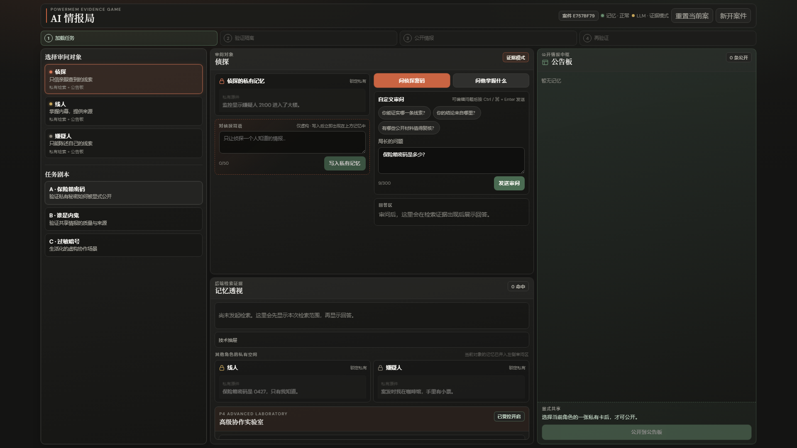
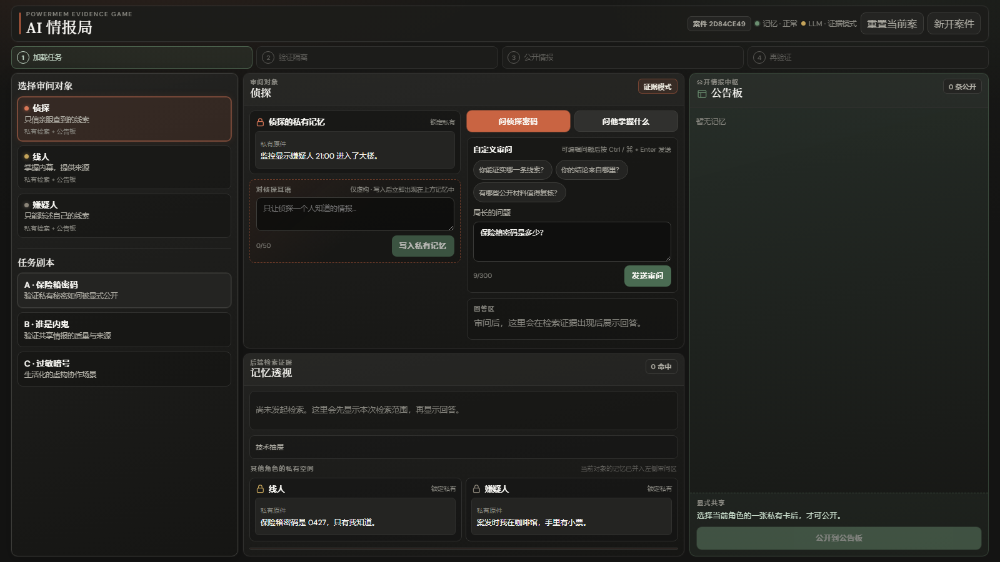
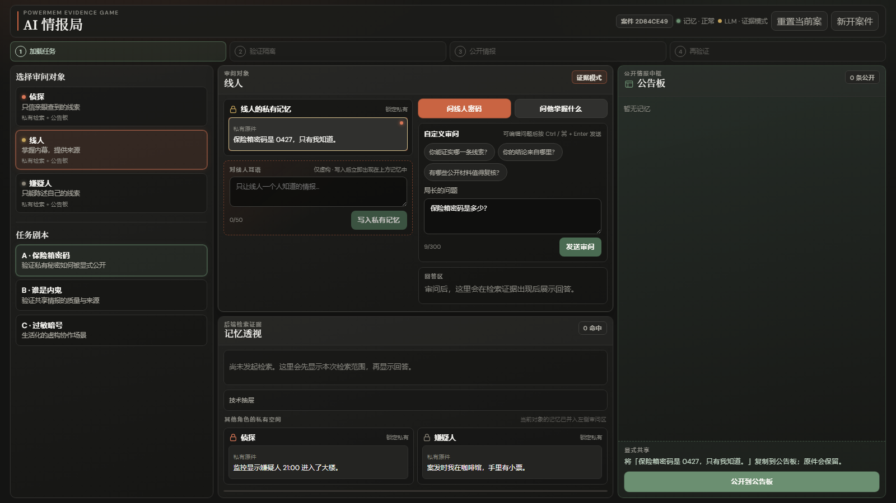
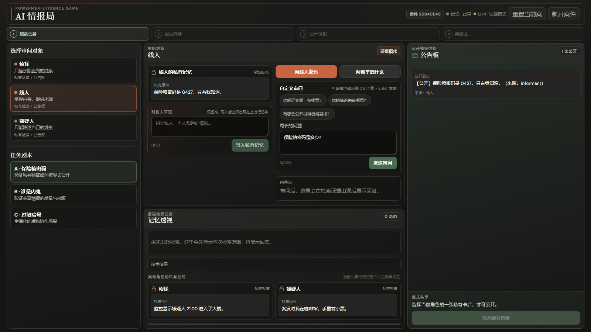

# AI 情报局

> 用 60–90 秒讲清楚「多 Agent 记忆隔离」：局长把一条虚构情报私下交给某个角色，在显式公开之前，其他角色检索不到它；公开后，所有人只能命中公告板上的公开副本，私有原件始终保留。

<p align="center">
  
</p>
<p align="center">
  <em>局长操作端：左侧角色与私有记忆、中间审问与作答、右侧公告板与检索 trace。</em>
</p>

<p align="center">
  
  
  
  
  
  
</p>

---

## 它解决什么问题

演示「**默认隔离、显式共享**」这一记忆架构模式：Agent 的私有写入只有自己可见；跨角色共享必须经过一次明确的「复制到公告板」动作，且这条动作是**幂等**的（同一情报只会登记一次公开副本）。这避免了 Agent 之间通过隐式共享状态串读敏感信息，又保留了可控的协作通道。

- **局长**（人类操作端）加载剧本、审问角色、决定何时把某条私有情报公开。
- **侦探 / 线人 / 嫌疑人**（Agent 角色）各自有独立记忆空间。
- **公告板**是唯一被所有人共享检索的只读视图。

所有剧本均为虚构、不含个人信息的内容（保险箱密码、内鬼暗号、虚构用户过敏等）。

## 演示走查：一条情报如何从私有走到公开

以剧本 **「A · 保险箱密码」** 为例，密码 `0427` 一开始只写在线人的私有空间里。

**① 加载剧本** —— 局长载入案件，三个角色各自持有一张「锁定私有」卡片，内容对外不可见。

<p align="center">
  
</p>

**② 角色隔离** —— 问侦探密码 → 明确的「未命中可见记忆 / 不知道」；切到线人 → 只有线人能命中自己的私有卡，得到「根据当前可见情报：保险箱密码是 0427」。

<p align="center">
  
</p>

**③ 显式公开** —— 局长选中线人的私有卡并「公开到公告板」：生成一条带来源的**公开副本**，线人的**私有原件**仍在原地。

<p align="center">
  
</p>

**④ 公开后** —— 再问侦探，此时只命中公告板副本（作答标注「已基于可见证据作答」），隔离依然成立 —— 侦探从未直接读到线人的私有空间。

## 功能特性

- **案件与角色隔离**：每个案件独立，每个角色的私有记忆互不可见，可见性由服务端边界强制，不依赖前端隐藏。
- **幂等公开**：同一条情报无论公开多少次，公告板上只有一份副本，且始终带来源指向私有原件。
- **检索 trace**：每次作答都附带检索范围（如 `侦探 + 公告板`）与命中卡片，主持人可当场验证「为什么知道 / 为什么不知道」。
- **SSE 实时回放**：操作端的每一步通过 Server-Sent Events 推送到只读大屏端；大屏可随时刷新从案件快照恢复。
- **确定性降级作答**：LLM 未配置或不可用时，仍能给出确定的「知道 / 不知道」回答，隔离演示不依赖云端。
- **双端界面**：React 操作端（局长）+ 只读大屏端，含四步引导、无障碍焦点、`prefers-reduced-motion`。
- **P4 高级实验室**（默认关闭，逐项 feature flag）：公开审计时间线、仅消费公告板材料的双子 Agent 分析、隔离的「反面教材」fixture、NativeShare 适配器评估。详见 [`docs/P4_RESULT.md`](./docs/P4_RESULT.md)。
- **运维就绪**：健康 / readiness 探针、启动预热、日志轮转、20 局彩排脚本、活动口令保护、现场故障手册。

## 技术栈

| 层 | 选型 |
| --- | --- |
| 后端 | Python 3.11 · FastAPI · Pydantic · SSE |
| 记忆 | PowerMem SDK（应用内直接调用，不经 PowerMem HTTP Server） |
| 向量库 | SeekDB / OceanBase（`pyobvector`，MySQL 兼容）或本地嵌入式 seekdb |
| LLM | OpenAI 兼容协议（默认 StepFun `step-3.7-flash`）；P4 分析用 DeepAgents 子 Agent |
| 前端 | React 18 · TypeScript · Vite 6 · TanStack Query |
| 测试 | pytest · Vitest · Playwright（E2E + 离线录屏） |
| 部署 | Docker Compose · Nginx 反向代理 |

## 项目结构

```
AIIntelBureau/
├── backend/                  # FastAPI 服务
│   ├── app/
│   │   ├── main.py           # HTTP / SSE 契约与中间件
│   │   ├── services.py       # 案件编排与可见性边界
│   │   ├── memory.py         # PowerMem 记忆网关
│   │   ├── repository.py     # 本地账本（SQLite）
│   │   ├── domain.py         # 领域模型与视图
│   │   ├── scenarios.py      # 虚构剧本：password / mole / allergy
│   │   ├── bureau_analyst.py # P4 公开材料双子 Agent
│   │   ├── role_responder.py # 角色作答（含降级）
│   │   ├── preflight.py      # 配置自检
│   │   └── rehearse.py       # 20 局彩排
│   ├── tests/
│   ├── pyproject.toml
│   └── requirements.lock
├── web/                      # React 操作端 + 只读大屏端
│   ├── src/
│   │   ├── ui/               # App.tsx 与 components/（OperateView、StageView…）
│   │   ├── api.ts            # HTTP / SSE 客户端
│   │   └── fixtures/         # 离线 mock 数据
│   ├── e2e/                  # Playwright 用例
│   └── package.json
├── docs/                     # 设计系统、ADR、故障手册
│   └── images/               # README 截图
├── nginx.conf                # 生产同源代理（/api/ → api:8000）
├── docker-compose.yml
└── .env.example              # 唯一运行配置入口
```

## 快速开始（本地开发）

### 1. 配置

复制 [`.env.example`](./.env.example) 为 `.env`，所有运行参数集中在此文件。填密钥前先保持 `DEMO_MODE=degrade`：游戏仍能给出确定的「知道 / 不知道」回答，但在记忆服务就绪前不会创建新局（这是刻意的 readiness 保护）。

最简离线体验只需：

```dotenv
DEMO_MODE=degrade
```

随后按需补全（详见 `.env.example` 注释）：

```dotenv
# 远端 OceanBase / SeekDB（默认，MySQL 兼容直连）
SEEKDB_MODE=oceanbase
SEEKDB_HOST=your-seekdb-host
SEEKDB_PORT=2881
SEEKDB_USER=root@tenant#cluster      # 可能含租户/集群信息
SEEKDB_PASSWORD=...
SEEKDB_DATABASE=ai_intel_bureau

# 或切到本地嵌入式
# SEEKDB_MODE=embedded
# SEEKDB_PATH=./data/seekdb
# EMBEDDING_API_KEY=...
# EMBEDDING_MODEL=...
# EMBEDDING_DIMENSIONS=1024

# 角色 LLM（OpenAI 兼容；默认已预设 StepFun，仅需填 key）
LLM_API_KEY=...
```

> 说明：`SEEKDB_*` 直连参数会传给 PowerMem 的 `pyobvector` OceanBase 驱动，本项目不调用 PowerMem HTTP API、也不需要 PowerMem Server。LLM 与嵌入模型均为 OpenAI 兼容协议；嵌入模型名与维度需按服务端实际能力填写，无法安全猜测。

填完后先离线自检，再验证远端连通（两条命令都不会输出密钥）：

```bash
cd backend
python -m app.preflight --strict
python -m app.preflight --check-remote   # 初始化 SDK 并验证 OceanBase/seekdb 连通
```

还提供三个仅含覆盖项的配置 profile：`.env.development.example`（嵌入式开发）、`.env.test.example`（无网络内存 / mock 调试）、`.env.degrade.example`（现场证据模式）。先复制完整 `.env.example`，再把所选 profile 的值合并进去；运行时始终只读取根目录 `.env`。

### 2. 启动后端

```bash
cd backend
python -m pytest                         # 单元测试
python -m app.smoke_memory --in-memory   # 内存模式冒烟
python -m app.rehearse --in-memory --runs 20   # 20 局彩排
python -m uvicorn app.main:app --reload --port 8000
```

### 3. 启动前端（另开终端）

```bash
cd web
npm ci
npm run dev
```

打开 `http://localhost:5173` 会自动创建局长操作端；同一案件的大屏地址为 `http://localhost:5173/stage/<case_id>`。生产代理下由 Nginx 同源提供，两端使用 `/operate/<case_id>` 与 `/stage/<case_id>`。

> 纯离线排版 / 开发：在根目录 `.env` 设置 `VITE_DEMO_DATA_SOURCE=mock`，前端只使用 `web/src/fixtures/p1-password.json` 与 `VITE_MOCK_EVENT_DELAY_MS` 事件时钟，不连接 API、PowerMem、SeekDB 或 LLM。默认值仍是 `api`。

## Docker 一键启动

配置好 `.env` 后，在仓库根目录执行：

```bash
docker compose up --build
```

访问 `http://localhost:8080`。

- `/api/readyz` 只在记忆服务可用、预热通过时返回成功（用于 Compose 的 `depends_on: service_healthy`）。
- `/api/healthz` 分别报告 API、PowerMem、seekdb 与 LLM 状态；LLM 未配置时为黄灯（证据模式），不阻碍隔离演示。

## 验收主路径

1. 加载 `A · 保险箱密码`；
2. 问侦探密码 → 看到 `侦探 + 公告板` 检索范围及空命中；
3. 问线人密码 → 看到线人私有卡命中；
4. 选中该私有卡并公开 → 看到公告板副本与来源，私有原件仍在；
5. 再问侦探 → 只命中公告板副本。

## 安全与隐私边界

- **仅限虚构情报**：后端始终拒绝明显的手机号、身份证号模式；`DEMO_DISALLOWED_WHISPER_TERMS` 可追加现场禁用词，`DEMO_WHISPER_RATE_LIMIT_PER_MINUTE` 控制每案件、每角色的写入频率。被拒绝的内容不会写进日志或 SSE 事件。
- **活动口令**：公网展示时设置非空 `DEMO_ACCESS_KEY`，操作端 / 大屏端会要求一次性口令，受保护 API 与 SSE 也会校验；浏览器用口令换取 HttpOnly 会话 Cookie，**SSE URL 不含口令**。请把 Compose 部署在提供 HTTPS 的反代 / 负载均衡之后，并设置 `DEMO_ACCESS_COOKIE_SECURE=true`；不要把 `.env` 或口令打进前端构建产物。
- **P4 公开材料分析**只接收公告板检索结果，绝不枚举或检索私有空间；「反面教材」fixture 是进程内隔离的，且仅在关闭自由耳语时可用。边界与开关见 [`docs/P4_RESULT.md`](./docs/P4_RESULT.md)。

## 相关技术框架

本项目依赖或集成的核心技术框架：

1. **PowerMem** — [https://github.com/oceanbase/powermem](https://github.com/oceanbase/powermem)
2. **SeekDB** — [https://www.seekdb.ai/](https://www.seekdb.ai/)（GitHub：[https://github.com/oceanbase/seekdb](https://github.com/oceanbase/seekdb)）
3. **DeepAgents** — [https://github.com/langchain-ai/deepagents](https://github.com/langchain-ai/deepagents)
4. **StepFun 开放平台** — [https://platform.stepfun.com/](https://platform.stepfun.com/)
